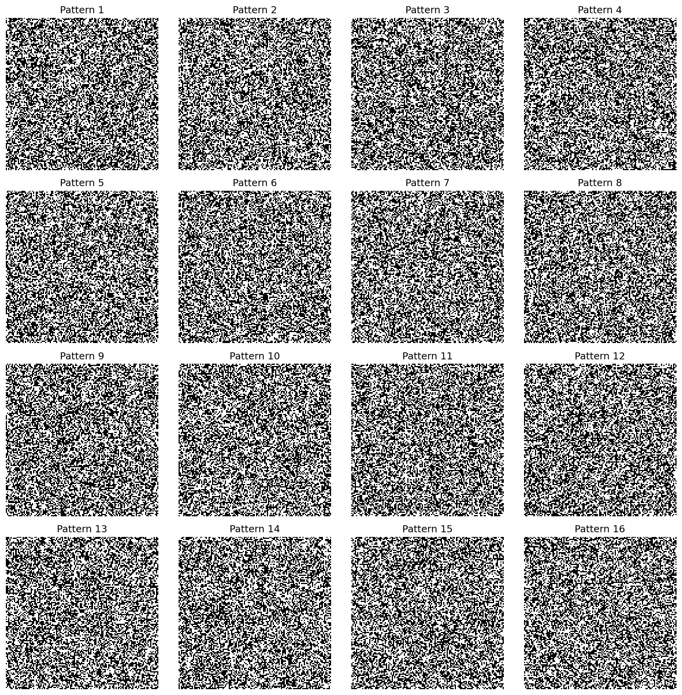
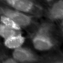
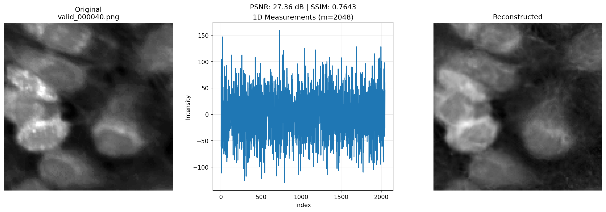
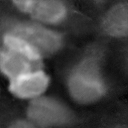
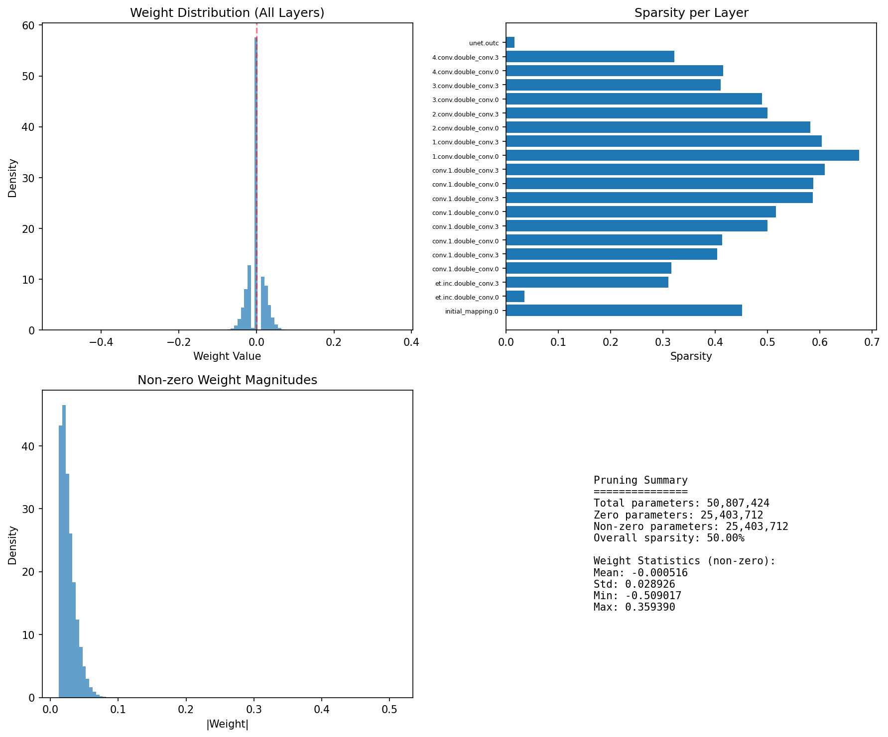

# Data-driven SPI: Reconstruction and Deployment

[](https://colab.research.google.com/github/Xia-Research-Lab/Data-driven-SPI/blob/main/colab_demo.ipynb)

Single-pixel imaging (SPI) reconstruction with deep learning and model pruning for efficient deployment.

## Quick Start

### Installation

```bash
# Clone the repository
git clone https://github.com/Xia-Research-Lab/Data-driven-SPI.git
cd Data-driven-SPI

# Create conda environment (recommended)
conda create -n spi python=3.11
conda activate spi

# Install dependencies
pip install -r requirements.txt
```

### Run Inference (Using Pre-trained Weights)

The `assets/` folder contains pre-trained weights and sample measurement data for quick testing:

```bash
# Run inference with the compressed model and sample measurements
python inference_for_deploy.py \
    --model_path assets/spi_pruned.pth.gz \
    --measurement_file assets/measurements_1.npy \
    --output_dir results/

# Benchmark inference speed
python inference_for_deploy.py \
    --model_path assets/spi_pruned.pth.gz \
    --measurement_file assets/measurements_2.npy \
    --benchmark \
    --num_benchmark_runs 100
```

**Pre-packaged Assets**:
| File | Description | Size |
|------|-------------|------|
| `assets/spi_pruned.pth.gz` | Pruned & compressed model weights | 59 MB |
| `assets/measurements_1.npy` | Sample measurement data #1 | 8 KB |
| `assets/measurements_2.npy` | Sample measurement data #2 | 8 KB |

**Expected Output**:
- Reconstructed 128×128 grayscale image saved to `results/`
- Benchmark: 324.7 fps with H200 and 580.0 fps on RTX 5090

---

## Overview

- **Input**: 2048 fixed binary measurements (12.5% sampling rate)
- **Output**: 128×128 grayscale images
- **Architecture**: U-Net based generator from measurements
- **Optimization**: 50% pruning + 3.29× compression for deployment
- **Dataset**: [CytoImageNet](https://www.kaggle.com/datasets/stanleyhua/cytoimagenet) - 128×128 grayscale cell images
- [TODO] **PTQ**: INT4/INT8 PTQ for real world deployment

## Dataset Preparation

The `data_prep.py` script provides an integrated pipeline to:
1. **Download** CytoImageNet dataset from Kaggle
2. **Resize** images to 128×128 and convert to grayscale
3. **Split** into train/test/valid sets using hash-based approach (prevents data leakage)
4. **Organize** files with consistent naming convention

```bash
# Full pipeline: download from Kaggle + process + split
python data_prep.py

# Skip download, only process existing dataset
python data_prep.py --skip-download

# Custom train/test/valid split sizes
python data_prep.py --train_size 8000 --test_size 1000 --valid_size 200
```

**Output Structure**:
```
cyto128/
├── train/     # 10000 training images (train_000000.png, ...)
├── test/      # 1000 test images (test_000000.png, ...)
└── valid/     # 100 validation images (valid_000000.png, ...)
```

**Note**: Requires [Kaggle API credentials](https://www.kaggle.com/docs/api) for downloading.

## Fixed Measurement Patterns



Pre-generated Hadamard/Random binary patterns for consistent measurements.

## Reconstruction Examples

| Original | Measurements | Reconstructed |
|:---:|:---:|:---:|
|  |  |  |

**Performance**: PSNR ~22-27 dB | SSIM ~0.65-0.85

---

## Full Pipeline: Training → Compression → Inference

### Step 1: Training

Train the U-Net generator from scratch on the Cyto128 dataset:

```bash
python train.py --epochs 100 --batch_size 16 --learning_rate 1e-3
```

This trains the model to reconstruct 128×128 images from 2048 binary measurements.

### Step 2: Model Compression (Pruning & Fine-tuning)

Apply 50% pruning to reduce model size while maintaining performance:

```bash
python deploy_pruned.py --checkpoint checkpoints/best_model.pth \
                         --prune_ratio 0.5 \
                         --prune_layers all \
                         --finetune_epochs 5
```



| Metric | Value |
|--------|-------|
| Original Size | 194 MB |
| Compressed Size | 59 MB |
| Compression Ratio | 3.29× |
| Sparsity | 49.98% |
| PSNR (original→pruned→finetuned) | 22.39 → 21.44 → 22.84 dB |
| Inference Speed | 324.7 FPS |

### Step 3: Inference

**Option A: Using Compressed Model (Recommended)**
```bash
python inference_for_deploy.py \
    --model_path pruned_output/generator_pruned_compressed.pth.gz \
    --measurement_file measurements.npy \
    --output_dir results/
```

**Option B: Using Original FP32 Model**
```bash
python inference.py --checkpoint checkpoints/best_model.pth --image_path test.png
```

---

## Project Structure

```
.
├── data_prep.py                  # Integrated dataset preparation tool
├── model.py                      # Generator & Discriminator architecture
├── losses.py                     # Training losses (binary regularization, adversarial)
├── train.py                      # Training script
├── deploy_pruned.py              # Pruning & compression pipeline
├── inference_for_deploy.py       # Optimized inference for compressed models
├── checkpoints/                  # Trained models (194 MB)
├── pruned_output/                # Pruned & compressed models (59 MB)
├── ptq_output/                   # Quantized models
├── cyto128/                      # Cyto128 dataset
│   ├── train/                    # 10000 training images
│   ├── test/                     # 1000 test images
│   └── valid/                    # 100 validation images
├── assets/                       # Pre-trained weights, sample data & visualizations
├── requirements.txt              # Python dependencies
└── README.md                     # This file
```

## Requirements

```txt
torch==2.9.1
torchvision==0.24.1
pytorch-lightning==2.6.0
pytorch_ssim==0.1
numpy==2.4.1
Pillow>=10.0.0
scikit-image==0.25.2
scikit-learn==1.8.0
torchmetrics==1.8.2
torchsummary==1.5.1
```

```bash
pip install -r requirements.txt
```